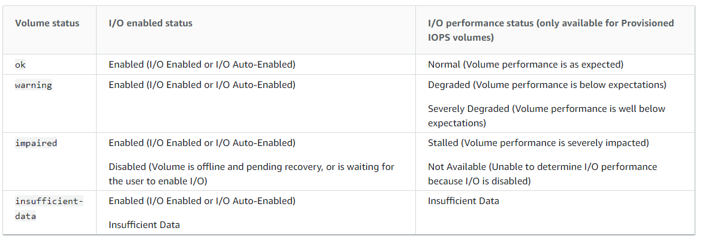
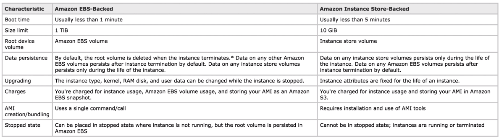
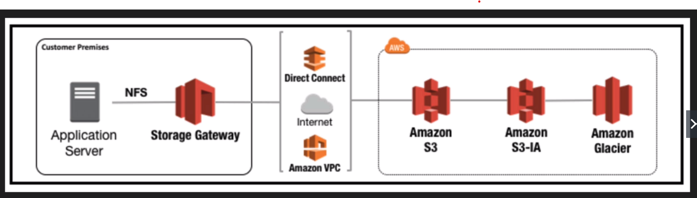
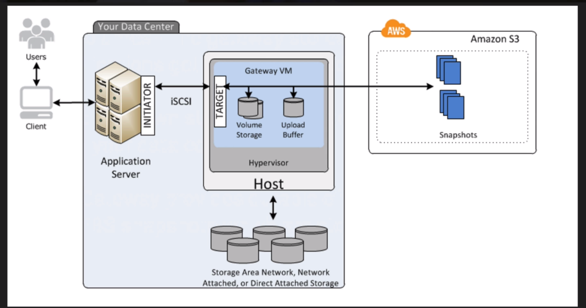
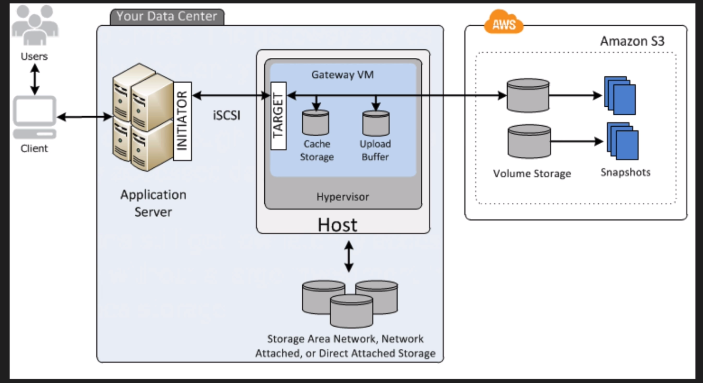
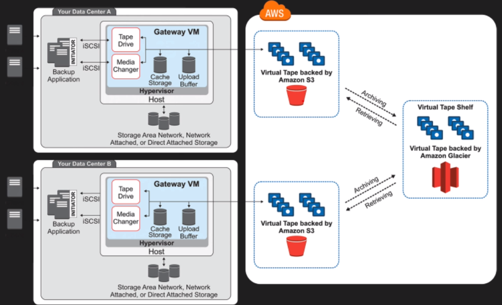
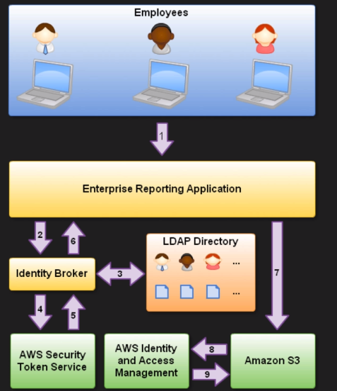

# AWS-SOA-C02 - AWS Certified SysOps Administrator - Associate
My study guide to study AWS Certified SysOps Adminstrator Associate Beta at early 2021

## Useful Links:
<a href="https://d1.awsstatic.com/training-and-certification/docs-sysops-associate/AWS-Certified-SysOps-Administrator-Associate_Exam-Guide_C02.pdf">Offical Exam Guide</a>

<a href="https://d1.awsstatic.com/training-and-certification/docs-sysops-associate/AWS-Certified-SysOps-Administrator-Associate_Sample-Questions_C02.pdf">Offsical Sample Exam Questions</a>

## Domain Outline (from Officeal Exam Guide)
Domain 1: Monitoring, Logging, and Remediation
1. Implement metrics, alarms, and filters by using AWS monitoring and logging services
    - Identify, collect, analyze, and export logs (for example, Amazon CloudWatch Logs, CloudWatch Logs
    Insights, AWS CloudTrail logs)
    - Collect metrics and logs using the CloudWatch agent
    - Create CloudWatch alarms
    - Create metric filters
    - Create CloudWatch dashboards
    - Configure notifications (for example, Amazon Simple Notification Service [Amazon SNS], Service
    Quotas, CloudWatch alarms, AWS Health events)
1. Remediate issues based on monitoring and availability metrics
    - Troubleshoot or take corrective actions based on notifications and alarms
    - Configure Amazon EventBridge rules to trigger actions
    - Use AWS Systems Manager Automation documents to take action based on AWS Config rules

Domain 2: Reliability and Business Continuity
1. Implement scalability and elasticity
    - Create and maintain AWS Auto Scaling plans
    - Implement caching
    - Implement Amazon RDS replicas and Amazon Aurora Replicas
    - Implement loosely coupled architectures
    - Differentiate between horizontal scaling and vertical scaling
1. Implement high availability and resilient environments
    - Configure Elastic Load Balancer and Amazon Route 53 health checks
    - Differentiate between the use of a single Availability Zone and Multi-AZ deployments (for example,
    Amazon EC2 Auto Scaling groups, Elastic Load Balancing, Amazon FSx, Amazon RDS)
    - Implement fault-tolerant workloads (for example, Amazon Elastic File System [Amazon EFS], Elastic IP
    addresses)
    - Implement Route 53 routing policies (for example, failover, weighted, latency based)
1. Implement backup and restore strategies
    - Automate snapshots and backups based on use cases (for example, RDS snapshots, AWS Backup, RTO
    and RPO, Amazon Data Lifecycle Manager, retention policy)
    - Restore databases (for example, point-in-time restore, promote read replica)
    - Implement versioning and lifecycle rules
    - Configure Amazon S3 Cross-Region Replication
    - Execute disaster recovery procedures

Domain 3: Deployment, Provisioning, and Automation
1. Provision and maintain cloud resources
    - Create and manage AMIs (for example, EC2 Image Builder)
    - Create, manage, and troubleshoot AWS CloudFormation
    - Provision resources across multiple AWS Regions and accounts (for example, AWS Resource Access
    Manager, CloudFormation StackSets, IAM cross-account roles)
    - Select deployment scenarios and services (for example, blue/green, rolling, canary)
    - Identify and remediate deployment issues (for example, service quotas, subnet sizing,
    CloudFormation and AWS OpsWorks errors, permissions)
1. Automate manual or repeatable processes
    - Use AWS services (for example, OpsWorks, Systems Manager, CloudFormation) to automate
    deployment processes
    - Implement automated patch management
    - Schedule automated tasks by using AWS services (for example, EventBridge, AWS Config)

Domain 4: Security and Compliance
1. Implement and manage security and compliance policies
    Version 1.0 SOA-C02 4 | P a g e
    - Implement IAM features (for example, password policies, MFA, roles, SAML, federated identity,
    resource policies, policy conditions)
    - Troubleshoot and audit access issues by using AWS services (for example, CloudTrail, IAM Access
    Analyzer, IAM policy simulator)
    - Validate service control policies and permission boundaries
    - Review AWS Trusted Advisor security checks
    - Validate AWS Region and service selections based on compliance requirements
    - Implement secure multi-account strategies (for example, AWS Control Tower, AWS Organizations)
2. Implement data and infrastructure protection strategies
    - Enforce a data classification scheme
    - Create, manage, and protect encryption keys
    - Implement encryption at rest (for example, AWS Key Management Service [AWS KMS])
    - Implement encryption in transit (for example, AWS Certificate Manager, VPN)
    - Securely store secrets by using AWS services (for example, AWS Secrets Manager, Systems Manager
    Parameter Store)
    - Review reports or findings (for example, AWS Security Hub, Amazon GuardDuty, AWS Config, Amazon
    Inspector)

Domain 5: Networking and Content Delivery
1. Implement networking features and connectivity
    - Configure a VPC (for example, subnets, route tables, network ACLs, security groups, NAT gateway,
    internet gateway )
    - Configure private connectivity (for example, Systems Manager Session Manager, VPC endpoints, VPC
    peering, VPN)
    - Configure AWS network protection services (for example, AWS WAF, AWS Shield)
2. Configure domains, DNS services, and content delivery
    - Configure Route 53 hosted zones and records
    - Implement Route 53 routing policies (for example, geolocation, geoproximity)
    - Configure DNS (for example, Route 53 Resolver)
    - Configure Amazon CloudFront and S3 origin access identity (OAI)
    - Configure S3 static website hosting
1. Troubleshoot network connectivity issues
    - Interpret VPC configurations (for example, subnets, route tables, network ACLs, security groups)
    - Collect and interpret logs (for example, VPC Flow Logs, Elastic Load Balancer access logs, AWS WAF
    web ACL logs, CloudFront logs)
    - Identify and remediate CloudFront caching issues
    - Troubleshoot hybrid and private connectivity issues

Domain 6: Cost and Performance Optimization
1. Implement cost optimization strategies
    - Implement cost allocation tags
    - Identify and remediate underutilized or unused resources by using AWS services and tools (for
    example, Trusted Advisor, AWS Compute Optimizer, Cost Explorer)
    - Configure AWS Budgets and billing alarms
    - Assess resource usage patterns to qualify workloads for EC2 Spot Instances
    - Identify opportunities to use managed services (for example, Amazon RDS, AWS Fargate, EFS)
2. Implement performance optimization strategies
    - Recommend compute resources based on performance metrics
    - Monitor Amazon EBS metrics and modify configuration to increase performance efficiency
    - Implement S3 performance features (for example, S3 Transfer Acceleration, multipart uploads)
    - Monitor RDS metrics and modify the configuration to increase performance efficiency (for example,
    performance insights, RDS Proxy)
    - Enable enhanced EC2 capabilities (for example, enhanced network adapter, instance store,
    placement groups)

## White Papers:
- <a href="https://d1.awsstatic.com/whitepapers/aws-security-whitepaper.pdf">Amazon Web Services: Overview of Security Processes</a> 
- <a href="https://d1.awsstatic.com/whitepapers/architecture/AWS_Well-Architected_Framework.pdf">AWS Well-Architected Framework</a>
- Amazon Virtual Private Cloud Connectivity Options
    - <a href="https://d1.awsstatic.com/whitepapers/aws-amazon-vpc-connectivity-options.pdf">PDF</a>
    - <a href="./white-paper-summaries/aws-amazon-vpc-connectivity-options.md">Note</a>
- <a href="https://d1.awsstatic.com/whitepapers/aws_pricing_overview.pdf">How AWS Pricing Works</a>

## Table of Content:
1. <a href="#cloudwatch">CloudWatch</a>
1. <a href="#ebs">EBS</a>
1. <a href="#elb">ELB</a>
1. <a href="#elasticache">Elasticache</a>
1. <a href="#aws-organizations">AWS Organizations</a>
1. <a href="#ec2">EC2</a>
1. <a href="#aws-config">AWS Config</a>
1. <a href="#bastion-host">Bastion Host</a>
1. <a href="#systems-manager">Systems Manager</a>
1. <a href="#rds">RDS</a>
1. <a href="#aurora">Aurora</a>
1. <a href="#cloudfront">CloudFront</a>
1. <a href="#s3">S3</a>
1. <a href="#kms">KMS</a>
1. <a href="#cloudhsm">CloudHSM</a>
1. <a href="#snowball">Snowball</a>
1. <a href="#storage-gateway">Storage Gateway</a>
1. <a href="#efs">EFS</a>
1. <a href="#aws-shield">AWS Shield</a>
1. <a href="#sts">STS</a>
1. <a href="#waf">WAF</a>
1. <a href="#aws-inspector">AWS Inspector</a>
1. <a href="#efs">AWS Trusted Advisor</a>
1. <a href="#shared-responsibility-model">Shared Responsibility Model</a>
1. <a href="#aws-artifact">AWS Artifact</a>
1. <a href="#route53">Route53</a>
1. <a href="#vpc">VPC</a>
1. <a href="#cloudformation">CloudFormation</a>
1. <a href="#elasticbeanstalk">ElasticBeanstalk</a>
1. <a href="#aws-opsworks">AWS OpsWorks</a>
1. <a href="#service-catalog">Service Catalog</a>
1. <a href="#aws-account-billing">AWS Account billing</a>
1. <a href="#amazon-quicksight">Amazon Quicksight</a>

## CloudWatch
- Monitoring service to monitor AWS resources.
- By default, Cloudwatch supports montoring on CPU, Network, Disk, Status Check. **RAM Utilization** is a custom metric. 
- Default monitoring interval: 5 mins
- Detailed monitoring interval: down to 1 minute intervals 

### CloudWatch Metrics
- retrieve data using **GetMetricStatistics** API
- Store **as long as you want** (indefinitely)
- Change the retention for each *Log Group*
- able to retrieve data logs from terminated EC2/ELB instances
- Metric Granularity: from 1 minute to 3/5 minutes
- 1 minute for detailed monitoring. 5 minutes for standard monitoring.
- *Minimum granularity* for custom metrics: 1 minutes

### CloudWatch Alarms
- clarm to monitor any CloudWatch metric
- set approriate thresholds to trigger the alarms and related actions

### CloudWatch on-premise
- download and install the SSM agent and CloudWatch agent. 

### CloudWatch Custom Dashboard
- can create CloudWatch metrics (even in different regions) into one place.

### Billing Alarms
- uses SNS topic to send out when the cost reach certain threshold. 

## EBS
- allows to create storage volumes and attach to EC2 instances
- used to create a file system, run a database, etc

Volume Types:
- General Purpose (SSD) - gp2
    - 3 IOPS/GB up to a maximum of 10,000 IOPS
    - System boot volumes
    - low-latency
- Provisioned IOPS (SSD) - io1
    - 50 IOPS/GB to a maximum of 64,000 IOPS
    - I/O intensive, NoSQL / relational databases
    - for critical applications for >10k IOPS / 160MiB/s throughput per volume
    - for large databse workloads
- Throughput Optizmized (HDD) - st1
    - streaming workloads requiring consistent, fast throughput at a low price
    - for big data warehouses and log processing
    - **Cannot be a boot volume**
- Cold (HDD) - sc1
    - legecy
    - for infrequently access
    - lowest storage
    - **Cannot be a boot volume**

### Monitoring EBS
- Pre-Warming EBS Volumes: storage blocks on volumes were restored fomr snapshots must be initialized (pulled down from S3 and writter to the volume) before you can access the block. This preliminary action takes time and cause a significant increase in the latency of an I/O application the first time each block is accessed.
- To avoid this issue: Initialization - reading from all of the blocks on your volume before using it. 

EBS Volume metrics (<a href="https://docs.aws.amazon.com/AWSEC2/latest/UserGuide/using_cloudwatch_ebs.html">Link</a> for details):
- `VolumeReadBytes`
- `VolumeWriteBytes`
- `VolumeReadOps`
- `VolumeWriteOps`
- `VolumeTotalReadTime`
- `VolumeTotalWriteTime`
- `VolumeIdleTime`
- `VolumeQueueLength`
- `VolumeThroughputPercentage`
- `VolumeConsumedReadWriteOps`
- `BurstBalance`

EBS Volume statuses: 

- Degraded/Severely Degraded = **Warning**
- Stalled/Not Available = **Impaired** (not available)

Modifiying EBS Volumes:
- can increase EBS size, volume type and adjust IOPS performance (for io1 volume) **without** deteching it.

### EBS vs Instance Store
- EBS:
    - allows data persistency and save data permanently 
- Instance Store: 
    - ephemeral storage which means non-persistence and temporary storage
    - cannot be stopped
    - volumes is lost if failure of underlying drive/ stopping EBS-backed instance/ terminate an instance
- 

### Moving EBS to another region/AZ
for moving between AZ:
1. stop EC2 instance (optional but best practice)
2. create snapshot
3. "Actions" => "Create Volume" => choose AZ
    - can change volume type and size.. etc
    - encrpyt

for moving between regions:
1. "Actions" => "Copy" => select region
2. Create Image from EBS Snapshot

### Snapshots
- exist on S3
- point in time copies of Volumes
- incremental
- can take snapshot while the instance is running
- can create AMI's from both images and snapshots
- can change EBS volume sizes on the fly, including chaning the size and storage type
- Volumes will **ALWAYS** be in the same AZ as the EC2 instance

## ELB
- consists of
    - Application Load Balancer (Layer 7)
    - Network Load Balancer (Layer 4, high network thoughtput)
    - Classic Load Balancer

### ELB error messages
- 400 - Bad request
- 401 - Unauthorized
- 403 - Forbidden - blocked by WAF access control list
- 460 - Client closed connection before the load balancer could respond
- 463 - Load balancer received an X-Forwarded-For request header with >30 IP addresses
- 4XX - client side errors

- 500 - Internal server error
- 502 - Bad gateway - application server closed the connection to the load balancer
- 503 - service unavailable - no registered targets 
- 504 - Gateway timeout - e.g. application is not responding
- 561 - Unauthorized - received an error code from the ID provider when trying to authenticate a user
- 5XX - server side errors

### Monitor Load Balancers
1. CloudWatch metrics
    - auto pop-up CloudWatch metrics
    - default: 60sec intervals
    - `BackendConnectionErrors`
    - `HealthyHostCount`
    - `UnHealthyHostCount`
    - `HTTPCode_Backend_2XX,3XX,4XX,5XX`
    - `Latency`
    - `RequestCount`
    - `SurgeQueueLength` (for classic load balancer only) # of pending requests, max queue size: 1024
    - `SpilloverCount` - (for classic load balancer only) # of requests rejected because the surge queue is full

2. Access logs
    - disabled by default
    - capture detailed information about requests sent to load balancer.
    - e.g. time of the request was received, client's IP address, latencies, request paths, and server responses.
    - stores in Amazon S3 bucket
    - **can store data where the EC2 instance has been deleted**

3. Request tracing
    - track HTTP requests from clients to targets or other services
    -  `X-Amzn-Trace-Id` header being added or updated when the load balancer receives a request from client
    - **for application load balancer only**

4. CloudTrail logs
    - CloudTrail monitors API calls in the AWS platform.
    - for audit purpose
    - can ensure files have not been tampered by enabling log file integrity (CloudTrail log file integrity validation)

## Elasticache
- used to significantly improve latency and throughput for read-heavy application workloads
- improves application performance by storing critical pieces of data in memory for low-latency access

### Memcached
- does not support multi-AZ

### Redis
- support multi-AZ
- in memory key-value store supports data strutures such as sorted sets and lists
- supports master/slave replication

### Monitoring elasticache
1. CPU Utilization
- (Memcached) add more nodes if exceeds 90% CPU utilization
- (Redis) threshold to deletemine scaling: 90 / # of cores
2. Swap Usage
- Memcached
    - should be around 0 most of the time and should not exceed 50Mb.
    - if swap usage exceeds 50MB, increase the `memcached_connections_overhead` parameters (defines the amount of memory to be reserved for memcached connections and other misc overhead)
- Redis
    - no swap usage metric, use reserved-memory instead
3. Evictions
- Memcached
    - either scale up (increase the memory of existing nodes) / scale out (add more nodes)
- Redis
    - Scale out (add read replicas)
4. Concurrent Connections

## AWS Organizations
- manage multiple AWS accounts at once. 
- allows centrally manage policies across multiple AWS accounts
- allows control access to AWS services
- allows automate AWS account creation and management
- allows consolidate billing across multiple AWS accounts
    - take advantages of pricing benefits from aggregated usage, e.g. volume discounts for EC2 and S3. 

### Service Control Policies
- control AWS service use across multiple AWS accounts.
- specify Allow/Deny individual AWS services

## EC2

### EC2 Options
#### On Demand
- low cost + flexibility without any up-front payment / long-term payment
- unpredictable

#### Reserved
- 1/3 years
- require reserved capacity
- upfront payments
    - Standard RI's (up to 75% off ondemand)
    - Convertible RI's (up to 54% off on demand)
        - capable to change the attributes of the RI to a equal or greater value
    - Scheduled RI's available to launch within the time windows that reserved
        - suitable for predictable recurring schedule

#### Spot
- flexible start and end times
- like stock market

#### Dedicted Hosts
- for regulatory requirements that may not support multi-tenant virtualization
- can be purphased On-Demand / Reservation for up to 70% ooff the on-demand price

### EC2 Launch Issues
#### `InstanceLimitExceeded` error - reached the limitation of the number of instances you can launch in a region. (20 by default)
#### `InsufficientInstanceCapacity` error - AWS does not currently have enough available on-demand capacity to serve your request
### Instance Status check failed - try rebooting the instance
### Lost of private key - detach the root volume from the instance and attach it to another instnace + modify the authorized_keys file on the volume

### Placement Groups
- By default
    - place instances across different physical hardware
    - minimizes the impact of a hardware failure
    - good for building resilient, highly available systems
    - not so great for low latency, high network throughput applications

#### Cluster
- instances are all created in **same AZ**
- good for requiring high network throughput
#### Partition
- can be multi-AZ
- instances are created in logical segments called partitions
- each located in a separate racks, with independent network and power
- may have multiple instance within the same partition
- great for large distributed / replicated workloads, such as HDFS, HBase and Cassandra
#### Spread
- only have 7 running instances per AZ
- each instance is created in a separate rack, with indepentent network and power
- good for small number of critical instances that should be separated
- reduces the risk of simultaneous failures when instances share the same racks
- guarantees your instances are placed in different racks with isolated power and networking

### EC2 Dedicated Instances
- Amazon EC2 instances that run in a VPC on hardware that's dedicated to a single customer
- physically isolated at the host hardware level from instances that belong to other AWS accounts
- **may share hardware with other instances from the same AWS account that are not dedicated instances**
- pay for dedicated instances on-demand
- save up to 70% by purchasing reserved instances
- save up to 90% by purchasing spot instances
- cost charged by instance

## EC2 Dedicated Hosts
- physical servers that are dedicated for your use
- gives additional visiility and control over how instances are placed on a physical server, and can consistently deploy instances to the same physical server over time.
- **enable to use existing server-bound software licenses and address corporate compliance and regulatory requirements**
- cost charged by host

### AMI
- provides all the information needed to launch an EC2 instance
    - template for root volume, e.g. OS, Applications
    - Launch permissions - defining which AWS accounts can use the AMI to launch instances
    - Block device mapping to specify EBS volumes to attach to the instance at launch time
- registered on a per-region basis
- Sharing AMIs:
    - Copying AMIs: the owner of source AMI must grant read permissions for the storage that backs the AMI
    - Limitation 1: cannot directly copy an encrypted AMI shared by another account
        - copy the snapshot and re-encrypt using your own key
        - the sharing account must share with you the underlying snapshot and encryption key used to create the AMI
    - Limitation 2: You cannot directly copy an AMI with an associated `billingProducts` code (applies to Windows, RedHat and AMIs from AWS Marketplace.)

### For Disaster recovery
1. Make an AMI of the EC2 instance
1. Copy the AMI to the destination region

## AWS Config
- per region basis
- provides AWS resource inventory, configuration history and configuration change notifications to enable security and governance
- Compliance auditing
- Security analysis
- Resource tracking
- provides configuration snapshots and logs config change of AWS resources
- provides automated compliance checking

infomation that we can see:
- Resource Type
- Resource ID
- Compliance
- Timeline
    - Configuration Details
    - Relationships
    - Changes
    - CloudTrail Events

### AWS Config Rules
- Compliance checks:
    - Trigger
        - Periodic
        - Configuration snapshot delivery (filterable)
    - Managed Rules
        - basic
- e.g.:
    - ensure SSH is always disabled on instances:
        - setup AWS Config Rules to ensure EC2 instances launched in a particular VPC are properly tagged
        - make sure that every instance is associated with at least one security group
        - check to make sure that port 22 is not open is any production security group

### Configuration **Items**
- Point-in-time attributes of resource

### Configuration **Snapshots**
- Collection of Config Items

### Configuration **Stream**
- Stream of changed Config Items

### Configuration **History**
- Collection of config items for a resource over time

### Configuration **Recorder**
- The configuration of Config that records and stores config items
- Setup:
    - logs config for account in region
    - stores in S3
    - Notify via SNS
- When a Configuration Recorder is stopped or deleted, the configuration change trigger does not run while periodic triggers continue to run at a specified period

### Multi-account multi-region data aggregation
- use AWS Config aggregator to collect data from all account in various regions. Accounts which are not part of AWS Organisation need to be individually added so that Aggregator can be authorised to collect data from these accounts

## Bastion Host
- a host located in public subnet
- allow to connect to EC2 instance using SSH/RDP
- login to the bastion host over the internet, from your desktop. then you can use the bastion host to initiate an SSH/RDP session over the private subnet to your EC2 instances in the private subnet
- enable safely administer your EC2 instance without exposing them to the internet

## Systems Manager
- gives visibility and control over your AWS infrastructure
- integrates with CloudWatch allowing to view your dashboards, view operational data and detect problems
- includes *Run Command* which automates operational tasks across resources - e.g. security patching, package installs
- organize your inventory, grouping resources together by application or environment - including on-premises systems.

To run in hybrid environment, action required:
1. complete general Systems Manager setup steps
1. Create an IAM Service Role for a Hybrid Environment
1. Install a TLS certificate on On-Premises servers and VMs
1. Create a Managed-Instance Activation for a hybrid environment
1. Install SSM Agent for a hybrid environment (Window & Linux)
1. (optional) enable the advanced-instances tier for more than 1000 servers per account per region

### Run Command
- allow you to run pre-defined commands on 1 or more EC2 instances
- Stop, restart, terminate, re-size instance
- attach / detach EBS volumes
- Create snapshots, backup DynamoDB tables
- Apply patches and updates
- Run an Ansible playbook
- Run a shell script

### AWS Systems Manager Parameter Store
- storing secrets and configuration data management + encrypt

### AWS Systems Manager Activations
- manage hybrid enviroment
- requires ssm-agent installed on-premise

## RDS

Supported versions:
- MySQL
- PostgreSQL
- MariaDB
- Aurora

### Multi-AZ 
- for for disaster recovery
- high availability
- backups/ restore's are taken from secondary which avoids I/O suspension to the primary
- AWS handles the failover. Done by updating the private DNS for the database endpoint
- manually reboot the instance for manually failover

### Read Replicas
- Key metric: **REPLICA LAG**
- can be multi-AZ
- DB Snapshots and automated backups cannot be taken
- `CreateDBInstanceReadReplica` API / AWS management console
- replicated using a supported engine's native, asynchronous replication
- for excess read traffic
- serving read traffic while the source DB instance is unavailable
- for business reporting or data warehousing scenarios
- brief I/O suspension when creating a new read replica (if Multi-AZ is not enabled)
- can be promotedd to it's own standalone database (it will break the asynchronous replication)

### Encrpting RDS Snapshots
Steps:
1. take a snapshot of existing RDS instance
2. copy the snapshot to the region
3. encrypt the copy during the copy process
4. restore the snapshot

### Sharing Encrypted RDS Snapshots between AWS accounts
steps:
1. create a **CUSTOM** KMS Encryption key
2. create an RDS snapshot using the custom key
3. Share the **CUSTOM** AWS KMS encryption key that was used to encrypt the snapshot
4. Use the AWS Management Console, AWS CLI, or Amazon RDS API to share the encrypted snapshot with the other accounts

- **CANNOT** share encrypted snapshots as public
- **CANNOT** share Oracle or Microsoft SQL server snapshots that are encrypted using Transparent Data Encryption (TDE).
- **CANNOT** share a snapshot that has been encrypted using the **default** AWS KMS encryption key of the AWS account that shared the snapshot

## Aurora
- encryption at rest is turned on by default
- MySQL/PostgreSQL compatible, relational database engine that combines the speed and availablity of high-end commercial database
- provides up to five times better performance than MySQL (and three times better performance than PostgreSQL) at a price point one tenth that of a commercial database while delivering similar performancee and availablity
- Start with 10GB, Scales in 10GB increments to 64TB (Storage Autoscaling)
- compute resources can scale up to 64vCPUs and 488GiB of memory
- **2 copies of data is contained in each AZ, with minimum of 3 AZ. 6 copies of your data.**
- Aurora storage is self-healing, Data blocks and disk are continuouly scanned for errors and repaired automatically
- 100% CPU Utilization? Scale Up if writes causing the isses. Scale Out read replicas if reads causing the issues 
- Failover is defined by tiers. The lower tier the higher priority being the highest priority available (Tier 0)

### Cross Region Replicas
- creating a new cross region replica will also create a new Aurora cluster in the target region.
- If the replication is disrupted, you will have to set up again
- **Recommened** to select `Multi-AZ Deployment` to ensure high avilability for the target cluster

### Aurora Serverless
- on-demand, auto-scaling configuration for Aurora where the database will automatically start-up, shutdown and scale up or down capacity based on your application's needs.
- pay on a per-second basis for the database capacity you use when the database is active

## CloudFront
- deliver webpages and other web content to a user based on the geographic locations of the user, the orgin of the webpage and a content delivery server
- Edge Location - location where content will be cached
- Origin - the origin of all the files that the CDN will distribute
- Distribution - the name given the CDN which consists of a collection of Edge Locations

- Web Distribution - used for websites
- RTMP - used for Media Streaming

### Error Messages
- 400 - Bad request
- 403 - Access denied (files must be publicly accessible)
- 404 - File Not Found

- 502 - Bad Gateway: CloudFront cannot connect to origin
- 503 - Service unavailable: Performance issues on origin server
- 504 - Gateway timeout: Request expired before a response was received from the origin server

### Cache Hit Ratios
- the ratio of request served from edge locations
- more request from edge location, the better the performance
- Maximise Cache Hit Ratio:
    - specify how long cloudfront caches your object
        - `Cache-Control` and `max-age`
    - caching based on query string parameters (*case sensitive)
    - caching based on cookie values
    - caching based on request headers
    - remove `Accept-Encoding` header when compression is not needed
    - serving media content by using http

## S3
- object-based
- size from 0 Bytes to 5TB
- unlimited storage
- Read after Write consistency for PUTS of new Objects
- Eventual Consistency for overwrite PUTS and DELETES (may take some time to propagate)

### S3 Storage Tiers:
- Standard
    - designed to sustain the loss of 2 facilities concurrently
- Standard - IA
    - for data that is accessed less frequently, but requires rapid access when needed
    - lower fee than S3 but charged for a retrieval fee
- Standard - One Zone IA
    - same as S3-IA but in one AZ only
    - cost is 20% less than S3-IA
- Reduced Redundancy Storage
    - used for data that can be recreated if lost, e.g. thumbnails.
- Glacier
    - very cheap, used for archival only
    - takes 3-5 hours to restore
    - **NO REAL TIME ACCESS**
    - To initiate an archive retrieval job, archive ID is required which can be found from vault inventory
    - Retreval options:
        - Expedited - quick retrieval of data, in 1-5 minutes
        - Standard - Default retrieval option, in 3-5 hours
        - Bulk - in 5-12 hours for a large amount of data & has lowest cost
    - Vault lock policy
        - lock vault for any future changes
        - 2-step process:
            - attack a vault lock policy to the vault & return a unique lock ID
            - if a Complete Vault is not initiated within 24 hours, vault lock policy is removed

### S3 Intelligent Tiering
- 2 tiers: Frequent and Infrequent access
- for unknown or unpredictable access patterns
- auto. move your data to msot cost-effective tier based on how frequently you access each object
- for cost optimization
- no fees for accessing data but small monthly fee for monitoring / automation

### S3 Charges
- storage per GB
- requests (get, put, copy, etc..)
- Storage Management Pricing (Inventory, Analytics and Obejct Tags)
- Data Management Pricing
    - data transfered out of S3
- Transfer Acceleration
    - use of CloudFront to optimize transfers

### S3 Lifecycle Policies
- manage object so that they are stored using the most cost effective S3 option throughout their lifecycle
- e.g. transition objects to less expensive storage classes, archive them or delete them
- e.g. transition objects to an IA storage class 90 days after creation
- e.g. configure objects to expire 1 year after creation

### S3 Versioning
- enables to revert to older version of S3 objects
- multiple version of an object are stored in the same bucket
- with versioning enabled, a **DELETE** action doesn't delete the object version, but applies a**delete marker** instead
- to permanently delete, provide the object Version ID in the delete request

### S3 MFA Delete
- provides an additional layer of protection to S3 Versioning
- enforce 2 things:
    - need a valid code from MFA device in order to permanently delete an object version
    - MFA also needed to suspend / reactivate versioning on an S3 bucket

### S3 Encryption
- In Transit: SSL/TLS
- At Rest:
    - Server Side Encryption:
        - S3 Managed key: **SSE-S3**
        - AWS KMS, managed keys, **SSE-KMS**
        - Server Side Encryption with Custom Provided Keys - **SSE-C**
            - customer in charge of rotation the keys
            - AWS handles the encryption / decryption
    - Client Side Encryption
        - encrypt the file before uploading to S3

#### Enforcing encryption on S3 Buckets:
- enforce SSE by using bucket policy which denies any S3 PUT request which doesn't include the  `x-amz-server-side-encryption` parameter in the request header
- includes `x-amz-server-side-encryption` in the request header
    - options:
        1. `x-amz-server-side-encryption`: `AES256` (SSE-S3)
        1. `x-amz-server-side-encryption`: `ams:kms` (SSE-KMS)

### Pre-signed URLs
- `aws s3 presign s3://bucket/key --expires-in 3600` (default 60 mintes)

## KMS
- shared hardware, multi-tenant managed service
- allow to generate, store and manage your encryption keys
- suitable for applications for which multi-tenancy is not an issue
- encrypt data stored in AWS
- uses symmetric keys

### KMS vs CloudHSM

|  | KMS | CloudHSM |
| - | --- | -------- |
| Tenancy | Multi | Single |
| Scale & HA | HA Service from AWS | HA Service from AWS |
| Key control | You + AWS | You |
| Integration | Broad AWS support | Broad AWS support
| Supported encryption | Symmetric | Symmetric and asymmetric
| Compliance | good | FIPS 140-2 & EAL-4 |
| Price | $ | $$ | 

## CloudHSM
- HSMs (Hardware Security Modules) are used to protect the confidentiality of your keys
- dedicated HSM instance, hardware is not shared with otehr tenants
- no free tier
- allow to generate, store and manage your encryption keys
- under your exclusive control within your own VPC
- FIPS 140-2 Level 3 compliance (US Government standard for HSMs)
    - includes tamper-evident physical security mechanisms
- suitable for applications which have a regulatory requirement for dedicated hardware managing cryptographic keys
- symmetric / asymetric encryption

## Snowball
- physical device used for transporting **many terbytes or petabytes** of data into and out of AWS
- makes large scale data transfers fast, easy and secure
- Tamper-resistant enclosure
- 256-bit encryption
- Region specific, not for transporting data from one region to another
- Good for:
    - dont want to make expensive upgrades to the network for a one-off data transfer
    - high-bandwidth internet is not available or is cost-prohibitive
    - takes more than a week to upload data

### Snowball Edge
- a 100TB device, which also features onboard compute power which can be clustered to act as a single storage and compute pool
- designed to undertake local processing / edge computing and data transfer
- S3-compatible endpoint, supports EFS, and run lambda functions as data is copied to the device
- S3 buckets and lambda functions come pre-configured on the device

### Snowball VS Snowball Edge
- Snowball is just a data transport solution
- Snowball Edge adds additional capability to run simple computing functions on the device
- Use Snowball Edge for use cases that require local processing before returing the data to AWS
- e.g. performing data analysis before writing the processed data to an S3 bucket on the Snowball Edge

## Storage Gateway
- consists of an on-premises software appliance which connects with AWS cloud-based storage to provide a seamless and secure integration between on-premises IT environment and AWS

- Storage Gateway Virtual Appliance is installed in data center
- Supports VMWare ESXi or Mircosoft Hyper-V
- On-premises systems seamlessly integratewith AWS storage

Types of Storage Gateway:
- File Gateway - NFS (Linux) / SMB (window)
- Volume Gateway (iSCSI)
    - Stored Volumes
    - Cached Volume
    - Tape Gateway (VTL)

### File Gateway
- files stored as objects in **S3 buckets**
- **accessed using NFS or SMB mount point**
- with benefits of S3: bucket policies, S3 versioning, lifecycle management, replication etc..
- low-cost alternative to on-premises storage

### Volume Gateway
- provides cloud backend storage which is accessed using iSCSI protocol
- 2 Types:
    - Stored Volumes: store your all data locally and only backup to AWS
        - low latency access to the entire dataset
        - need own storage infrastructure as all data is stored locally in data center
        
    - Cached Volumes: use S3 as primary storage and cache frequently accessed data in your Storage Gateway
        - durable off-set async backups in form of EBS snapshots which are stored in S3
        - only need enough local storage capacity to store the frequently accessed data
        - still get low-latency access to frequently used data without a large investment in on-premises storage
        

### Tape Gateway
- virtual tape library which provides cost effective data archiving in the clouid using Glacier
- DONT need to invest own tape backup infrastructure
- integrates with existing tape backup infrastructure - NetBackup, Backup Exec, Veeam etc... which connect to the VTL using iSCSI
- Data is stored on virtual tapes which are stored in Glacier and accessed using the VTL
 

## Athena
- interactive query service that enables to analyse and query data located in S3 using SQL
- serverless, pay per query / per TB scanned
- Use cases: query log files stored in S3, e.g. ELB logs, S3 access logs
- specify S3 bucket: s3://bucketname/prefix/

## EFS
- enables cross AZ, region, VPCs, on-premises
- managed Network File System, highly available and scalable
- Standard NFS protocol used by Linux Systems
- allows multiple EC2 instances access the file system at once
- lifecycle management capability
- supports encryption at rest / in transit
- Encryption at rest can **ONLY** be enabled at file system creation

To mount EFS from another VPC:
- **DNS resolution IS NOT supported**
- an IP address needs to be used or a private hosted zone can be created in Route53

## DDoS
To mitigate DDoS
- minimize the attack surface area
- be ready to scale to absort the attack
- safeguard exposed resources
- learn normal behavior
- create a plan for attacks

## AWS Shield
- free server that protects all AWS customers on ELB, CloudFront and Route53
- protects against SYN/UDP Floods, Reflection attacks, and other layer3/layer 4 attacks
- Advanced provides enhanced protections for applications running on ELB, CloudFront and Route53 against larger and more sophisticated attack. $3000 per month
- AWS Shield Advanced provides
    - always-on, flow-based monitoring of network traffic and active application monitoring to provide near real-time notifcation of DDoS attacks
    - DDoS Response Team (DRT) 24X7 to manage and mitigate application layer DDoS attacks
    - Protects AWS bill against higher fees due to ELB, CloudFront and Route53 usage spikes during DDoS attack

## STS
- grants users limited and temp. access to AWS resources. Users can come from 3 sources:
    - Federation (typically Active Directory)
        - Uses Security Assertion Markup Lanage (SAML)
        - grants temporary access based off users Active Directory credentials (Does not need to be a user in IAM)
        - Single sign on allows users to log in to AWS console without assigning IAM credentials
    - Federation with Mobile Apps
        - Use Facebook/Amazon/ Google or other OpenID providers to log in
    - Cross Account Access
        - users from one AWS account to access resources in another
- `Role`, `RoleSessionName` and `Audience` are required attributes which needs to be present in SAML assertion send to AWS STS.

Key Terms:
- Federation: combning or joining a list of users in one domain with a list of users in another domain (such as Active Directory)
- Identity Broker: a service that allows you to take an identity from point A and join it (federate it) to point B
- Identity Store: services like Active Directory, Facebook, Google etc
- Identities - a users of a service like Facebook

Example:

Steps:
1. Employee enters username and password
2. The application calls an identity broker which captures the username and password
3. The identity broker users the organization's LDAP directory to validate the employee's identity
4. The identity broker calls the new `GetFederationToken` function using IAM credentials. The call must include an IAM policy and a duration (1-36 hours), along with a policy that specifies the permissions to be granted to the temporary security credentials
5. The STS confirms that the policy of the IAM user making the call to `GetFederationToken` gives perimssion to create new tokens and then returns four values to the application:
    - access key
    - secret access key
    - token
    - duration
6. The identity broker returns the temporary security credentials to the reporting application
7. The data storage application users the temporary security credentials (including the token) to make request to Amazon S3
8. Amazon S3 uses IAM to verify that the credentials allow the requested operation on the given S3 bucket and key
9. IAM provides S3 with the go-ahead to perform the requested operation

## WAF
- web application firewall that lets you monitor the HTTP and HTTPS request that are forwarded to CloudFront or Application Load Balancer or to API Gateway. AWS WAF also lets you control access to your content
- e.g. configure condition like what IP addresses are allowed to make this request or what query string parameters need to be passed for the request to be allowed, and then the ALB/CloudFront will either allow this content to be received or to give HTTP 403 Status Code
- allows 3 different behaviours:
    - Allow all request except the ones that you specify
    - Block all request except the ones that you specify
    - Count the requests that match the properties that you specify
- attributes that can be used to define conditions:
    - IP addresses
    - Country originate from
    - Values in request header
    - Strings that appear in requests, either specific strings or string that match regex patterns
    - Length of requests
    - Presence of SQL injection
    - Presence of a script that is likely to be malicious (aka cross-site scripting)
- integrates with ALB/Cloudfront/API Gateway
- **DOES NOT** integrate with classic load balancer/network load balancer

## AWS Inspector
- an automated security assessment service that helps improve the security and compliance of applications deployed on AWS.
- automatically assesses applications for vulnerabilities or deviations from best practices.
- produces a detailed list of security findings prioritized by level of severity after performing an assessment
- How does it work?
    - Create `Assessment target`
    - Install agents on EC2 instances
    - Create `Assessment template`
    - Perform `Assessment run`
    - Review `Findings` against `Rules`

## AWS Trusted Advisor
- an online resource to help you reduce cost, increase performance and improve security by optimizing your AWS environment.
- will advise you on Cost Optimization, Performance, Security, Fault Tolerance
- Core Checks And Recommendations
- Full Trusted Advisor - Business and Enterprise Companies Only
- Service Limit check (in performance category) displays your usage and limits for some aspects of some services

## Shared Responsibility Model

### AWS Security Responsibilities
- Global infrastructure
- hardware, software, networking and facilities 
- "managed services"

### Customer Security Responsibilities
- Infrastructure as a Service (IaaS)
- including updates and security patches
- configuration of the AWS provided firewall

## AWS Artifact
- provides on-demand downloads of AWS security and compliance documents, such as AWS ISO certifications, Payment Card Industry (PCI), and Service Organization Control (SOC) reports.
- you can submit the security and compliance documents (aka audit artifacts) to your auditors or regulators to demonstrate the security and compliance of the AWS infrastructure and services that you use

## Route53
- Simple Routing
    - 1 record with multiple IP addresses in random order
- Weighted Routing
    - split traffic based on weights assigned
    - e.g. 80% and 20% send to different IP addresses
- Latency-based Routing
    - route traffic based on the lowest network latency for your end user
- Failover Routing
    - active/passive set up (route to passive when active is down)
- Geolocation Routing
    - choose where your traffic will be sent based on the geographic location of your users
- Multivalue Answer Routing

### use on-premise DNS server for resolving DNS names
- assign your own domain name to your instances and use up to four of your own DNS servers
- to do that, you must specify a special set of DHCP options to use with the VPC
- details: <a href="https://docs.aws.amazon.com/vpc/latest/userguide/VPC_DHCP_Options.html">Link</a>

## VPC
- logically isolated section of AWS cloud where you can launch AWS resourecs in a virtual network
- can do
    - launch instances into a subnet
    - assign custom IP address ranges in each subnet
    - configure route tables between subnets
    - create internet gateway and attach to VPC
    - better security control over AWS resources
    - instance security groups
    - subnet network access control list (ACLs)
- 1 subnet = 1 AZ

### VPC Peering
- allow to connect one VPC with another via a direct network route using private IP addresses
- instances behave like they are in the same network
- can peer with other AWS account's VPC
- star configuration: i.e. 1 central VPC peers with 4 others. **NO TRANSITIVE PEERING**
- can be cross regions

### Subnet
- can only have 1 network ACL
- some reserved IP addresses 
    - **first 4 IP addresses and last IP address in each subnet CIDR block are reserved**
        - 10.0.0.0: network address
        - 10.0.0.1: Reserved by AWS for the VPC router
        - 10.0.0.2: Reserved by AWS for DNS
        - 10.0.0.3: Reserved by AWS for future use
        - 10.0.0.255: network broadcast address

### Internet Gateway
- allow network access
- 1 VPC can only have 1 internet gateway and cannot attach to different VPC at the same time

### NAT Instances and NAT Gateways
- not suggest to use NAT instances as it might be a single point of failure
- NAT Gateways
     - put in public subnet
     - and then add entry in `Routes` in Route Table
        - Destination: `0.0.0.0/0` and target as the NAT Gateway

### Network ACL
- comes with default, defauly it allows all outbound and inbounrd
- by creating custom network ACLs, each custom network ACL denies all inbound and outbound traffic until you add rules
- each subnet in VPC must be associated with a network ACL. otherwise, default ACL
- can associate a network ACL with multiple subnets; but a subnet can only have one network ACL at a time
- contain numbered list of rules that is evaluated in order, starting with the lowest numbered rule
- stateless; responses to allowed inbound traffic are subject to the rules for outbound traffic, vice versa.
- can block IP address using network ACLs but not security groups

### VPC Flow Logs
- capture information about the IP traffic going to and from network interfaces in VPC.
- 3 levels:
    - VPC
    - Subnet
    - Network Interface Level
- *cannot enable flow logs for VPCs that are peered with your VPC unless the peer VPC is in your account
- after you 've created a flow log, you cannot change its configuration, e.g. can't associate a different IAM role with the flow log
- Note: not all IP traffic is monitored;
    - traffic generated by instances when they contact the Amazon DNS server
    - traffic generated by a windows instance for Amazon Windows license activation
    - traffic to and from 169.254.169.254 for instance metadata
    - DHCP traffic
    - traffic to the reserved IP address for the default VPC router

## CloudFormation
- allow to manage, configure and provision AWS infrastructure as code
- YAML / JSON format
- Resulting resources are called a `Stack`
- Structure of CloudFormation template:
    - `Description`
    - `Metadata`
    - `Parameters` - input custom values
    - `Conditions` - e.g. provision resources based on environment
    - `Mapping` - own user-defined value, e.g. `ami`
    - `Transform` - include snippets of code outside the main template
    - `Resources` - [Mandatory] the AWS resources that you are deploying
    - `Outputs` - user-defined the output values
- Best Practices
    1. IAM - Control access to CloudFormation using IAM
    1. Be Aware of Server Limits - If you hit a limit then CloudFormation will fail to create stack
    1. Avoid Manual Updates - Manual changes create a mis-match between your stack template and the current state of the stack
    1. Use CloudTrail - Log calls to CloudFormation using CloudTrail so that it will log a trail of all changes and who made them
    1. Stack Policy - Specify a stack policy whenever creating a stack that has critical resources
        - stack policy is a JSON document that describes what update actions can be performed on designated resources
        - helps protect critical stack resources from unintentional updates and mistakes caused by human error

### CloudFormation Rollback
- `UPDATE_ROLLBACK_FAILED` - CloudFormation cannot rollback all changes during an update
- You Can No Longer Update - You can't update a stack which is in `UPDATE_ROLLBACK_FAILED` state
- Fix The Error - Usually you need to fix the error causing the failure before you can continue to rollback

## ElasticBeanstalk
- service for deploying and scaling web applications developed in popular languages:
    - Java
    - .NET
    - PHP
    - Node.js
    - Python
    - Ruby
    - Go
    - Docker
- onto widely used application server platforms like Apache Tomcat, Nginx, Passenger, and IIS
- Fastest and simplest way to deploy application in AWS
- integrated with CloudWatch and X-Ray for performance data and metrics
- Provision the underlying resources

## AWS OpsWorks
- service which allows to automate server configuration using Puppet or Chef
- enables configuration management for your OS and applications
- allow to automate server config using code
- works with existing Chef and Puppet code

## Service Catalog
- Catalog - portfolio of products. available as a portal CloudFormation templates
- Access Control - with users, groups and roles get access to a portfolio of products
- Enforce Standards - Approved resources only. Compliance with internal policies. Allowed Services. Configuration

- Portfolio
    - collection or grouping of products 
    - Selectively grant access
    - IAM users, groups, roles
    - Browse and launch product
    - Regional
    - can share with other AWS account
- Product
    - Service or application
    - EC2, EBS volume, DB
    - Multi-tier web application
    - Defined by a CloudFormation template

## AWS account billing
Cost & Usage Report:
- customised reports
- multiple files which consists of data files for usage, separate file for discounts if any & a manifest file listing data files in a report. 
- Columns in Cost & Usage Reports can be added or removed based upon customer requirements

## Amazon QuickSight
- Standard Edition
    - can invite an IAM user & allow them to user their credentials to access
    - does not support encryption at rest
- Enterprise Edition
    - can select AD groups in directory services for access
    - support encryption at rest