# Amazon Virtual Private Cloud Connectivity Options
Short key point summary on the <a href="https://d1.awsstatic.com/whitepapers/aws-amazon-vpc-connectivity-options.pdf">White paper</a>

 

## User Network to Amazon VPC Connectivity Options
Use case: integrating AWS resources with existing on-site services by extending internal networks into AWS Cloud (it allows internal users to seamlessly connect to resources hosted on AWS)

Options:
- AWS Managed VPN
    - IPsec VPN connection between remote customer networks and their Amazon VPC over the internet
    - includes automated multi-data center redundancy and failover built into the AWS side of the VPN connection
    - 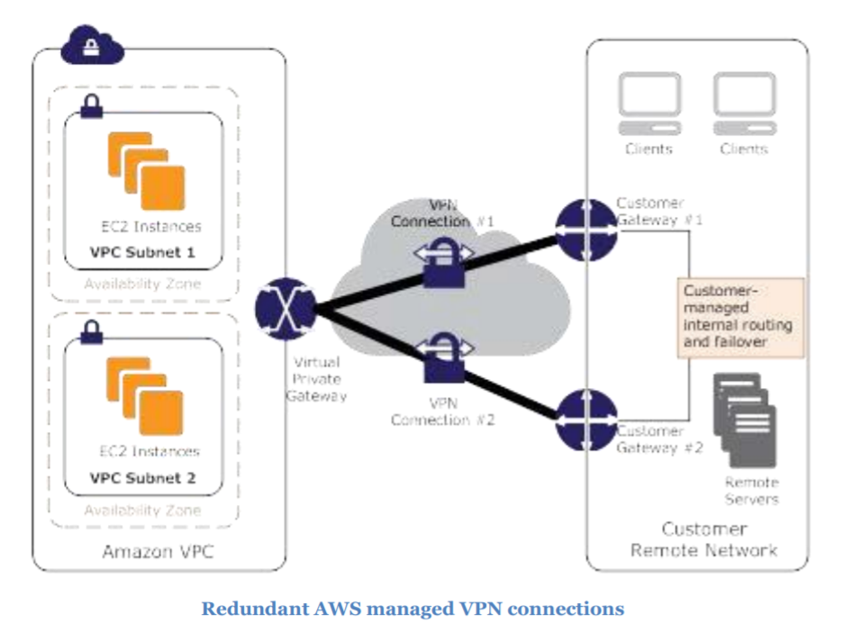
- AWS Direct Connect
    - private connectivity between AWS and data center, office or colocation environment
    - 1 Gbps or 10 Gbps dedicated network connections between AWS networks and one of the AWS Direct Connect locations
    - 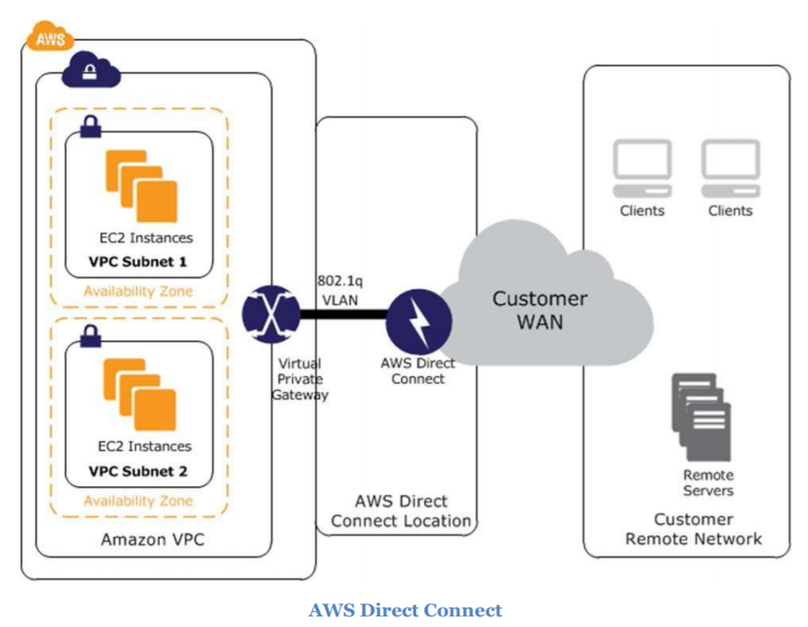
    - 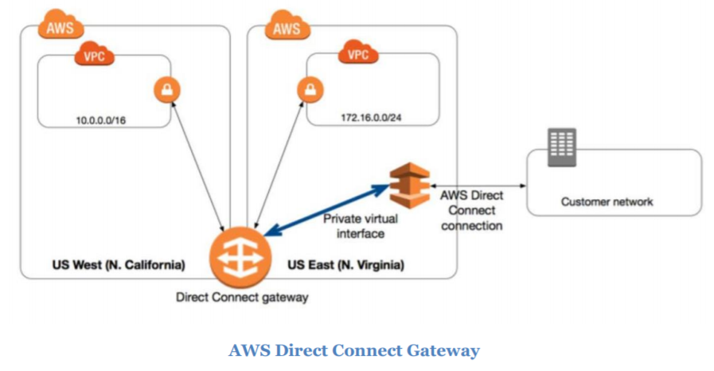
- AWS Direct Connect + VPN
    - combine one or more AWS Direct Connect dedicated network connections with the Amazon VPC VPN
    - 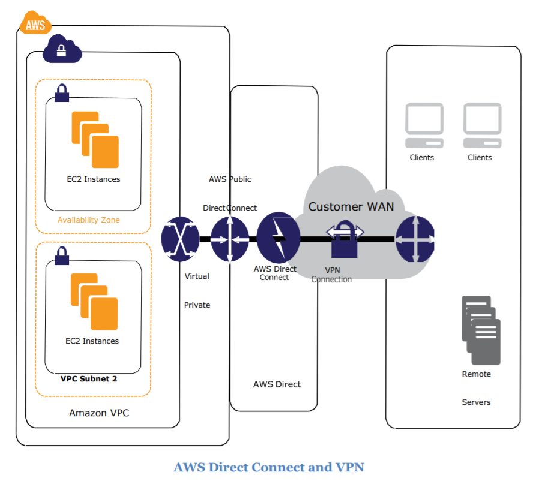
- AWS VPN CloudHub
    - operates on a simple hub-and-spoke model that you can use with / without a VPC
    - for primary or backup connectivity for remote offices
    - 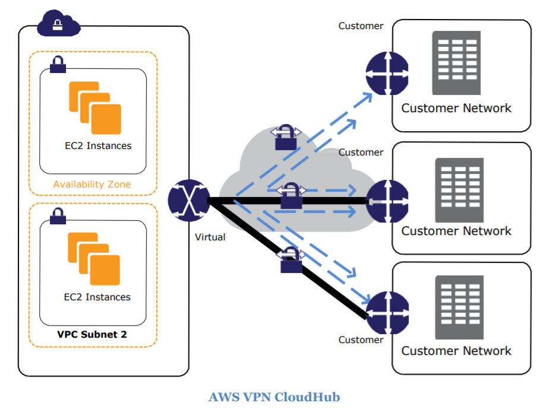
- Software VPN
    - recommended if you must manage both ends of the VPN connection either for compliance purposes or for leveraging gateway devices that are not currently supported by Amazon VPC's VPN solution
    - 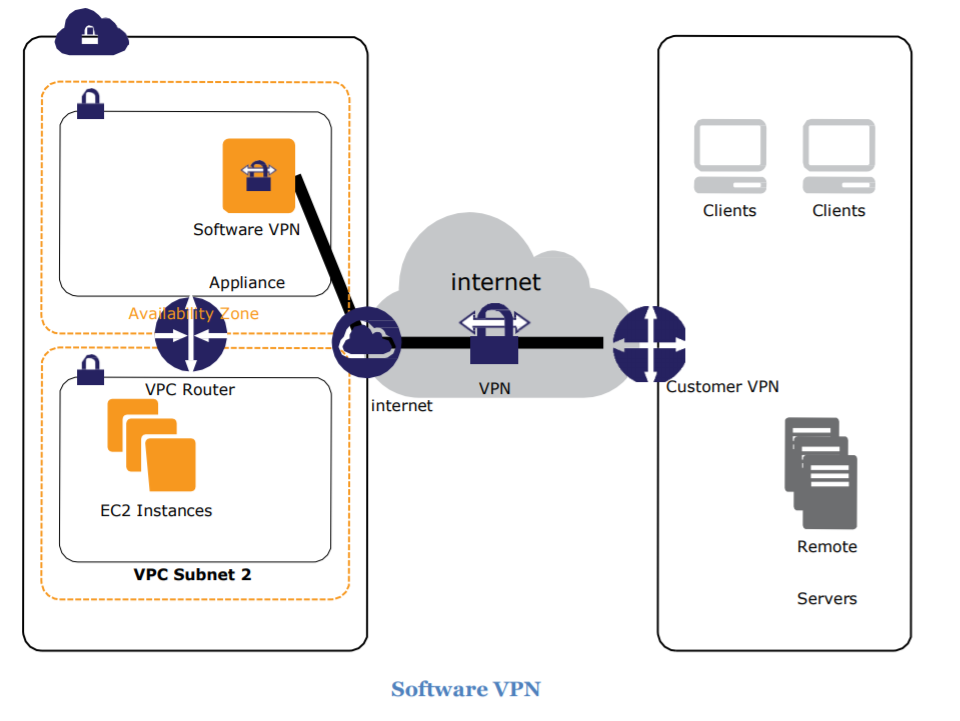
- Transit VPC
    - common strategy for connecting multiple, grographically disperse VPCs and remote networks in order to create a global network transit center
    - 

## Amazon VPC to Amazon VPC Connectivity Options
Use Case: integrate multiple Amazon VPC's into a larger virtual network

Options:
- VPC Peering
    - networking connection between two VPCs that enable routing using each VPC's private IP addresses as if they were in the same network
    - supports cross account VPC + inter-region peering
    - 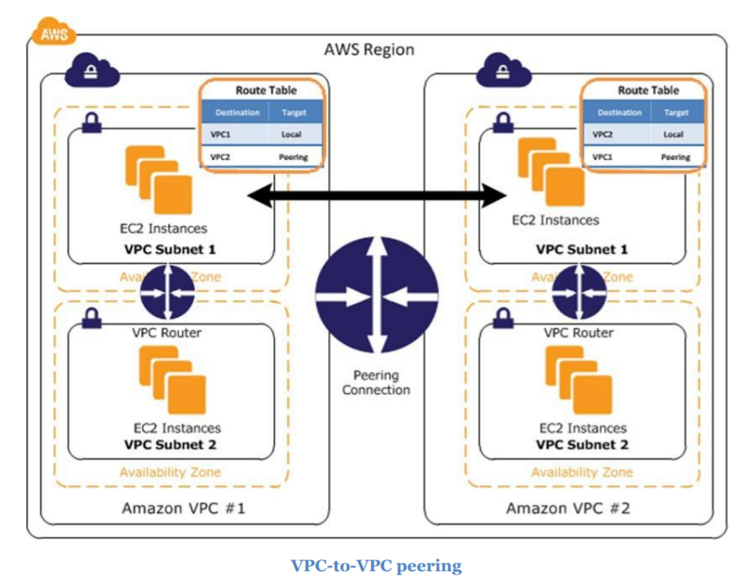
- Software VPN
    - recommended if you want to manage both ends of the VPN connection using your preferred VPN software provider
    - 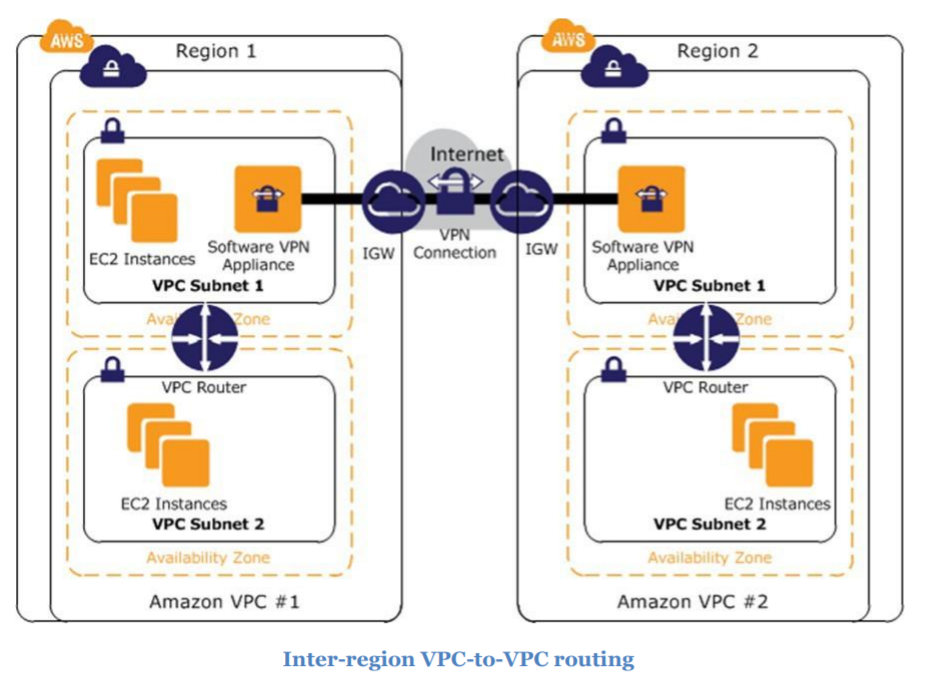
- Software-to-AWS Managed VPN
    - create secure VPN tunnels between a software VPN appliance and a virtual private gateway to connect multiple VPCs into a larger virtual private networ.
    - allow seamlessly connect to instances in each VPC using private IP addresses
    - 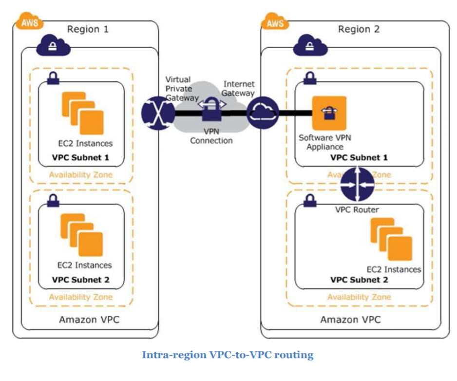
- AWS Managed VPN
    - IPsec VPN to connect remote networks with Amazon VPCs over the internet
    - 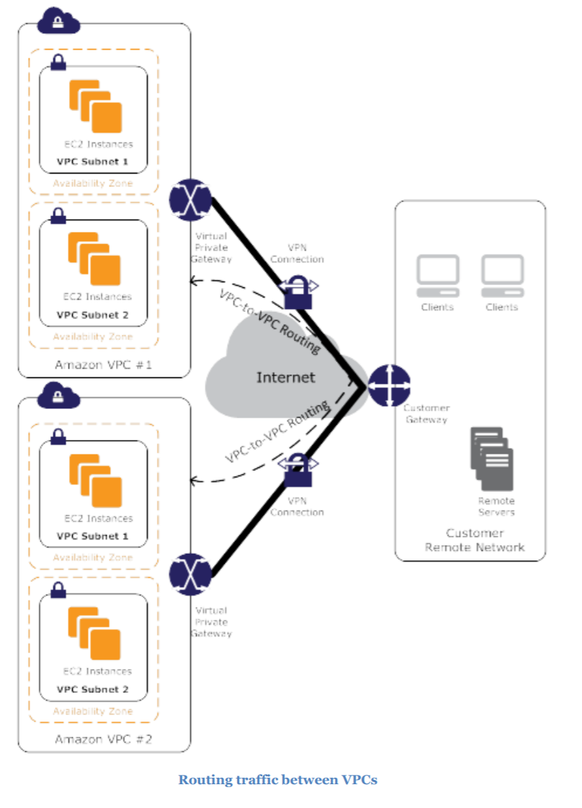
- AWS Direct Connect
    - dedicated network connection from on-premises to Amazon VPC or among Amazon VPCs
    - 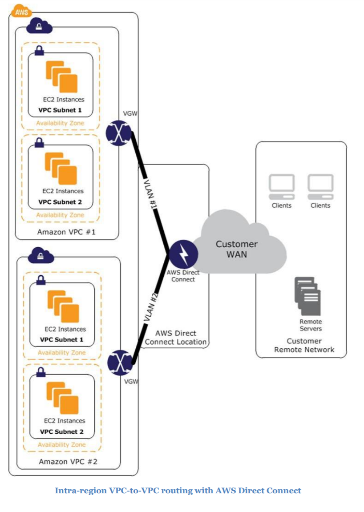
- AWS Private Link
    - An interface VPC endpoint (AWS Private Link) enables you to connect to services powered by AWS PrivateLink.
    - recommanded if you want to use services offered by another VPC securely over private connection
    - 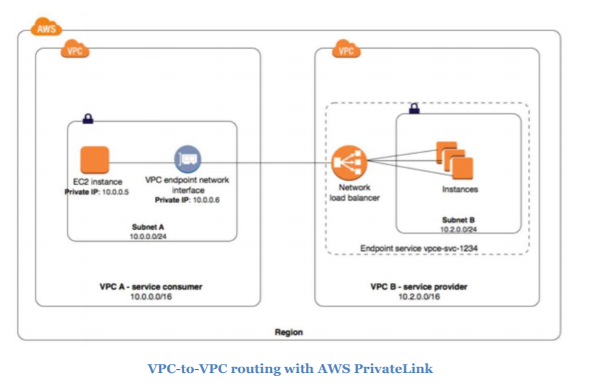

Internal User-to-Amazon VPC Connectivity Options
- typically accomplished either via <a href="user-network-to-amazon-vpc-connectivity-options">User Network to Amazon VPC Connectivity Options</a> or the use of software remote-access VPNs

Software Remote-Access VPN:
    - Cloud-based remote access solution to Amazon VPC and/or internal networks
    - preferred by smaller companies with less extensive remote networks
    - 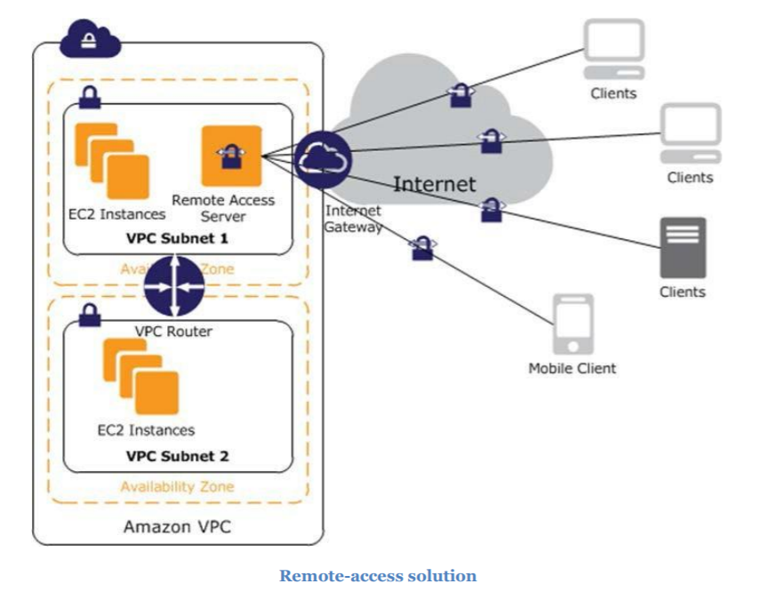
    - 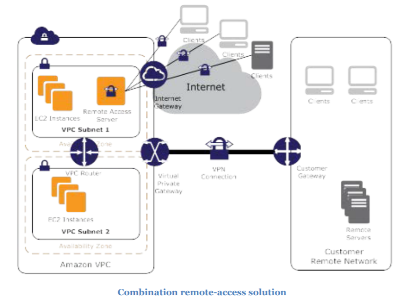

## Appendix
### High-Level HA Architecture for Software VPN Instances
 - 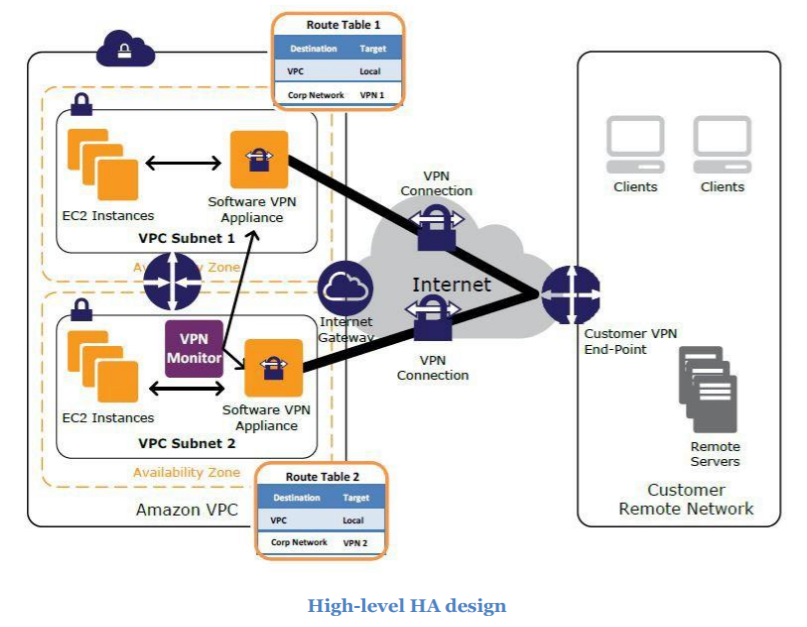

### VPN Monitoring
- VPN monitor for monitoring Software based VPN appliance
    - custom instance to run VPN monitoring scripts
- CloudWatch metrics for monitoring AWS Managed VPN tunnels